# MultiCinema

# 목차

1. 기획의도
2. 팀원구성
3. 개발환경
4. 기술구현 내용
5. DB ERD
6. 페이지 소개
7. 성과

# 기획의도

With Corona시대에 맞춰 지금까지 억눌려 왔던 시민들의 야외 문화생활에 대한 욕구가 터져나올 것을 기대하며 배우와 영화의 정보를 고객에게 제공하고 간단하게 영화티켓과 음식쿠폰을 구매하는 서비스를 제공하기 위하여 'MultiCinema'라는 영화관 사이트를 기획하게 되었다. 

# 팀원구성

* 김리영
* 김원규
* 도상우
* 박상우
* 허건희

# 개발환경

* Front-end : javascript / jquery / bootstrap
* Back-end : java / spring boot
* DB : Mysql
* OS : windows 10

# 기술구현 내용

* RESTful api 서버
* 로그인 / 회원가입
* 티켓 구매
* 음식 구매
* 영화 정보 및 리뷰
* 배우 정보
* 고객센터
* 관리자페이지
* 마이페이지
* 카카오페이 결제
* 챗봇(naver cloud api이용)

# DB ERD

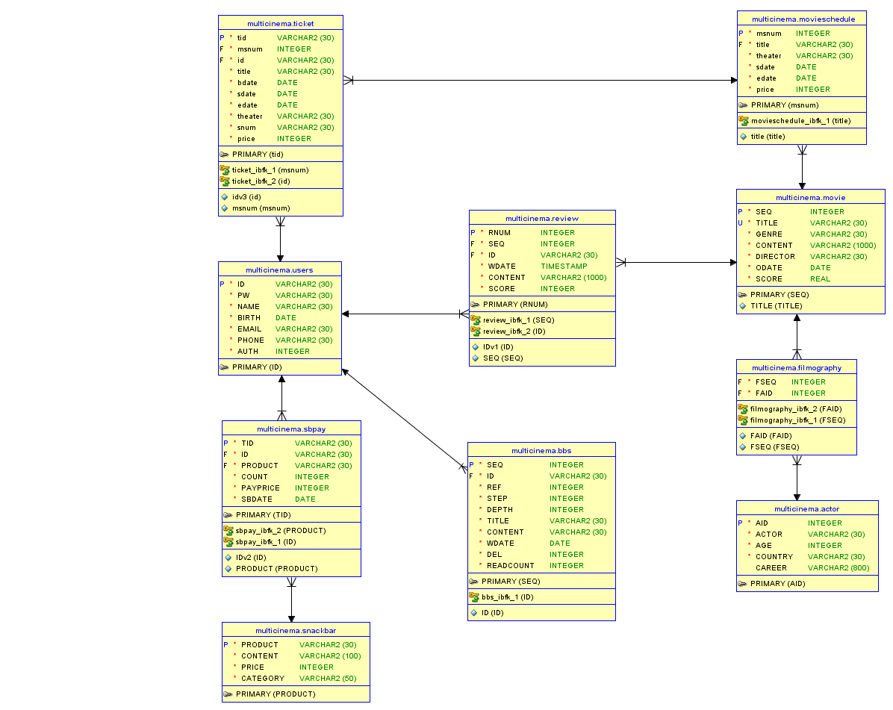

# 페이지 소개

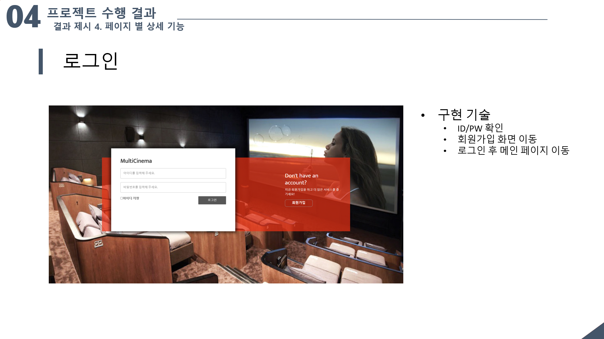

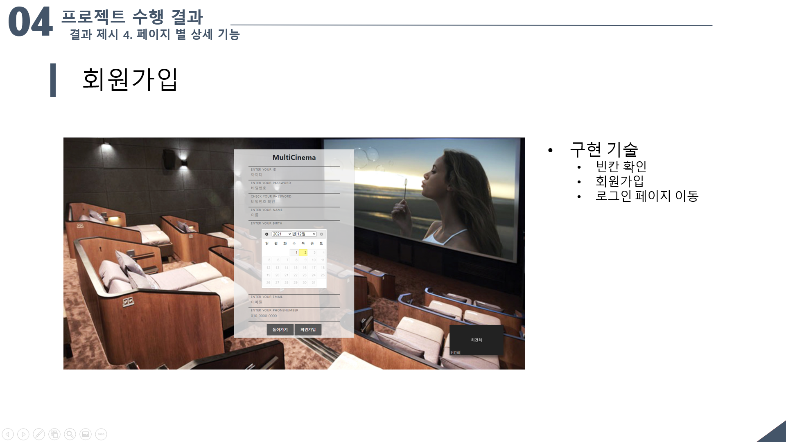

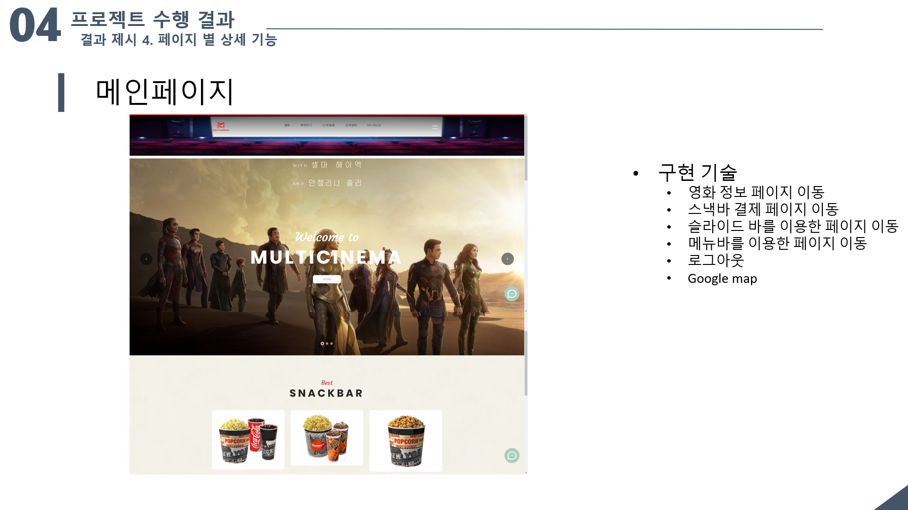

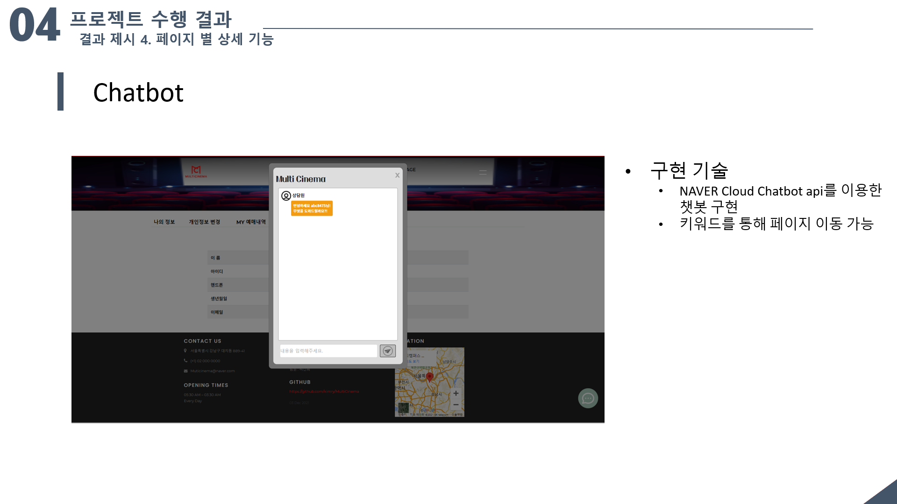

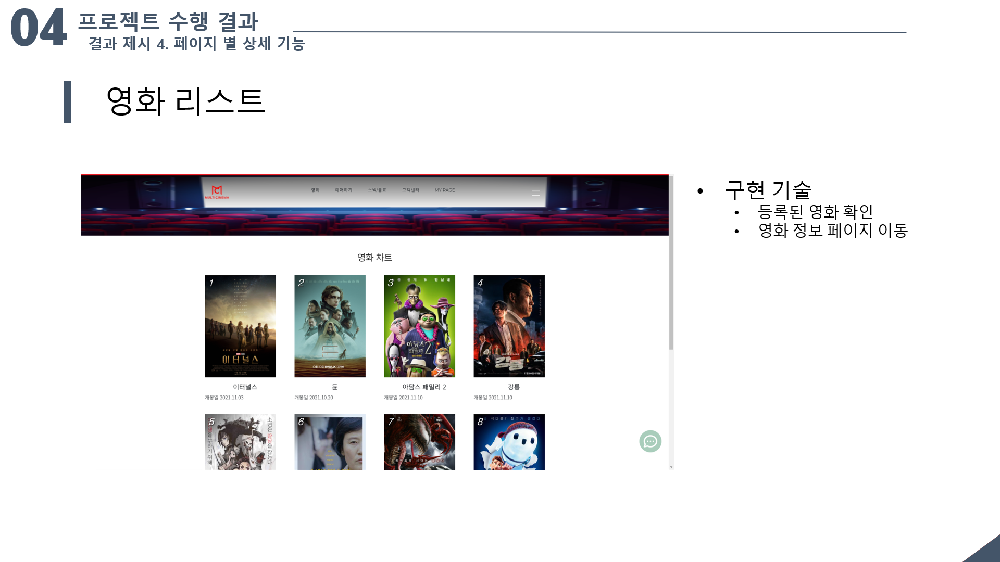

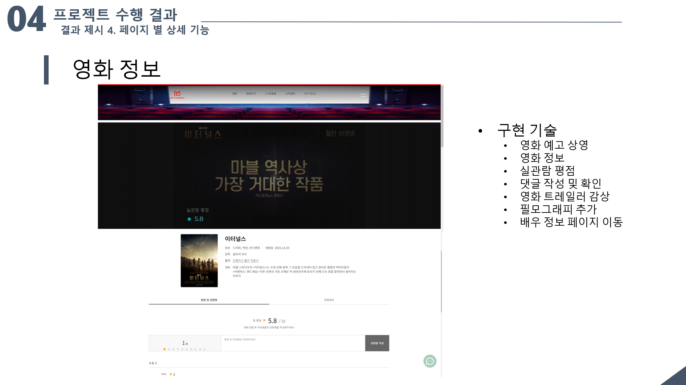

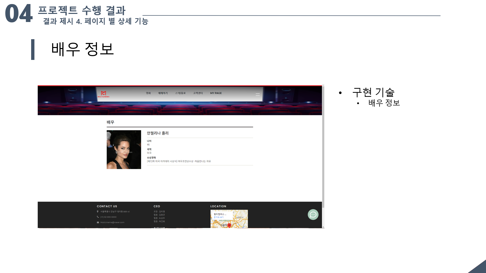

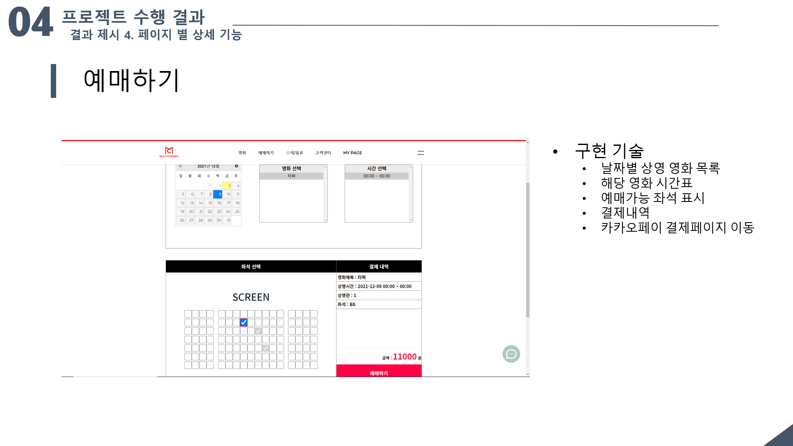

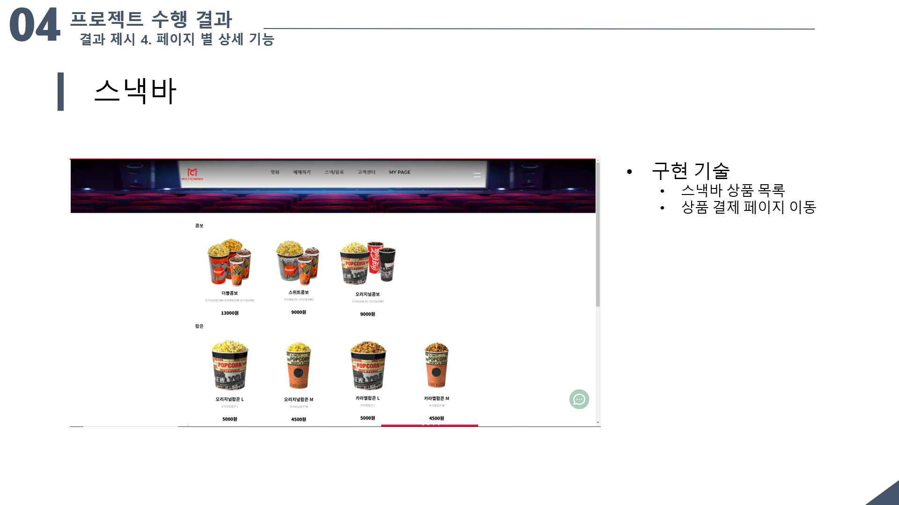

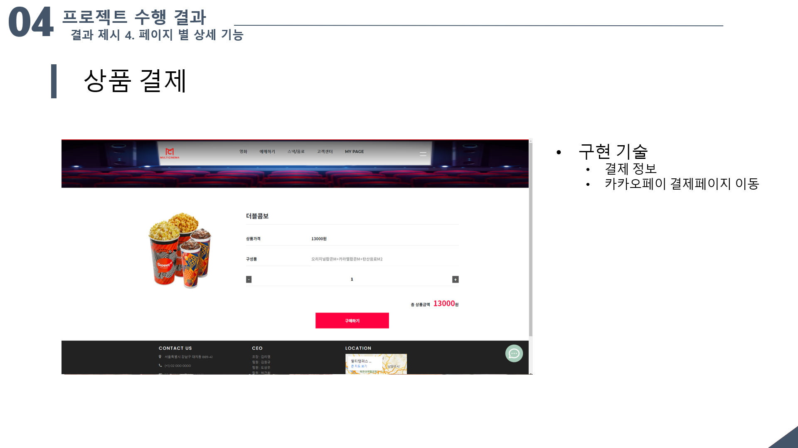

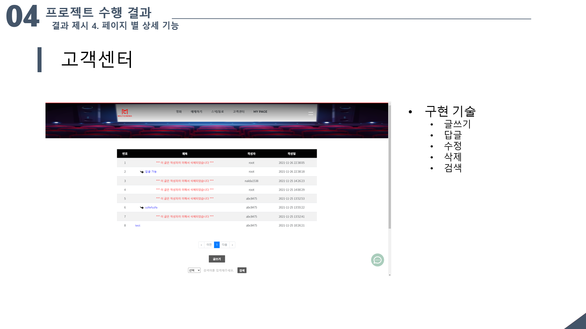

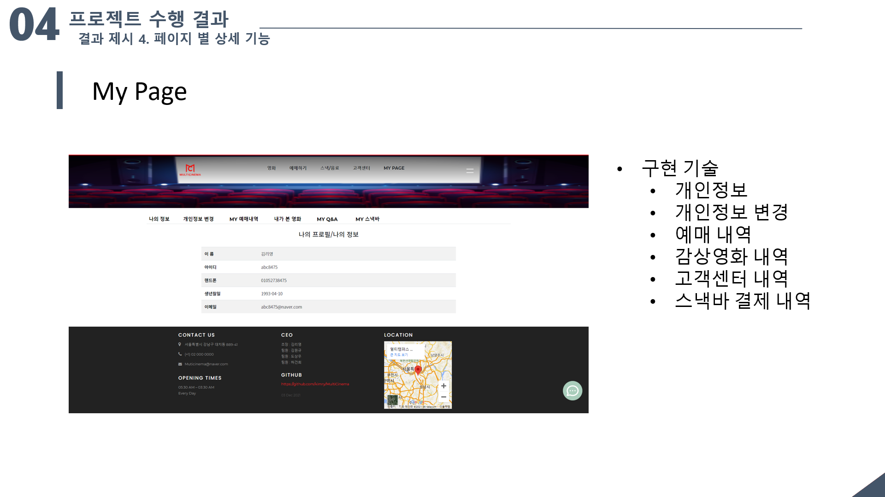

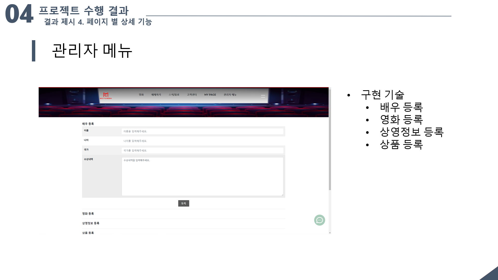

# 성과

* spring boot와 RESTful api를 적용한 첫번째 프로젝트였고 외부 open api나 NAVER Cloud를 이용한 AI api를 사용해 볼 수 있었기 때문에 개인적으로 많은 도움이 되었다고 생각하고 조원들이 각자의 역할을 잘 수행해 냈기 때문에 시간 대비 만족스로운 결과물을 만들어 냈다고 생각한다.
